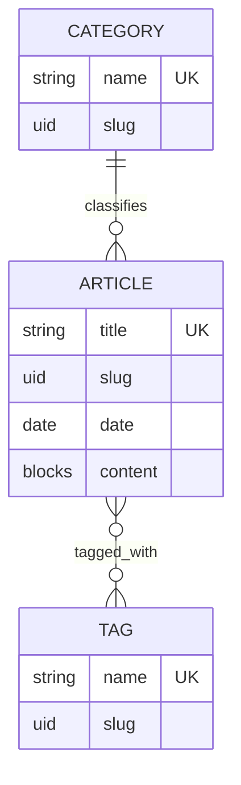

# Strapi 5 Training API

Backend headless CMS untuk latihan pemodelan konten, Content API, Draft & Publish,
authorization, query REST, extension layer, dan observability Strapi 5. Repository ini
memisahkan pengelolaan konten di Administration Panel dari konsumsi konten melalui
REST API sehingga frontend dapat memilih data yang benar-benar dibutuhkan.

## Tech stack

- Strapi `5.53.0`, TypeScript 5, Node.js 20–26
- PostgreSQL 8 driver (`pg` `8.20.0`); SQLite tetap tersedia untuk local fallback
- Users & Permissions plugin untuk Content API
- Nodemailer provider untuk integrasi email
- Postman collection schema 2.1

## Prasyarat

- Node.js 20–26 dan npm
- PostgreSQL yang dapat diakses oleh aplikasi
- Database kosong atau database training yang sudah ada
- Postman Desktop untuk menjalankan collection interaktif

## Menjalankan project

1. Clone repository, lalu masuk ke direktori project.
2. Salin `.env.example` menjadi `.env` dan ganti seluruh placeholder secret.
3. Buat database PostgreSQL sesuai nilai `DATABASE_NAME`.
4. Install dependency dan jalankan Strapi:

   ```bash
   npm ci
   npm run develop
   ```

5. Buka `http://localhost:1337/admin` untuk Administration Panel. Content API berada
   di `http://localhost:1337/api`.

Build produksi dapat diverifikasi dengan `npm run build`, kemudian dijalankan dengan
`npm start`.

## Environment variables

Jangan commit nilai secret aktual. `.env.example` berisi variabel keamanan inti.
Konfigurasi database mendukung variabel berikut:

| Variable | Fungsi | Contoh aman |
| --- | --- | --- |
| `HOST`, `PORT` | Bind address dan port Strapi | `0.0.0.0`, `1337` |
| `APP_KEYS` | Signing keys aplikasi | nilai acak, dipisahkan koma |
| `API_TOKEN_SALT` | Salt API token | nilai acak |
| `ADMIN_JWT_SECRET` | Secret JWT admin | nilai acak |
| `TRANSFER_TOKEN_SALT` | Salt transfer token | nilai acak |
| `JWT_SECRET` | Secret Users & Permissions | nilai acak |
| `ENCRYPTION_KEY` | Kunci enkripsi internal | nilai acak |
| `DATABASE_CLIENT` | Driver database | `postgres` |
| `DATABASE_HOST`, `DATABASE_PORT` | Lokasi PostgreSQL | `127.0.0.1`, `5432` |
| `DATABASE_NAME`, `DATABASE_USERNAME`, `DATABASE_PASSWORD` | Kredensial database | isi lokal masing-masing |
| `DATABASE_SCHEMA`, `DATABASE_SSL` | Schema dan mode TLS | `public`, `false` |
| `SMTP_HOST`, `SMTP_PORT`, `SMTP_USERNAME`, `SMTP_PASSWORD` | Konfigurasi email | sesuai provider |

## Content model

Collection Types:

- `Article`: title, UID slug, date, image, block content, category, dan tags.
- `Category`: nama/slug serta kumpulan article yang memakai category tersebut.
- `Tag`: nama/slug serta relasi many-to-many dengan article.
- `Product`: nama/slug, satu image, dan block description.
- `Career`: lowongan dengan tipe pekerjaan, blocks, status aktif, dan waktu kedaluwarsa.
- `Testimonial`: identitas client, testimonial, media, dan rating 1–5.

Single Type `Company Profile` menyusun informasi perusahaan dari komponen overview,
vision/mission, business license, history, management, dan award.



`Article → Category` adalah many-to-one: setiap article wajib mempunyai satu category,
sedangkan sebuah category dapat dipakai banyak article. `Article ↔ Tag` adalah
many-to-many: satu article dapat mempunyai banyak tag dan satu tag dapat dipakai banyak
article.

## Role matrix

Role Admin dan Editor berikut adalah role Administration Panel. Role Public adalah role
Users & Permissions untuk Content API; ketiganya bukan role yang sama.

| Capability | Admin (Admin Panel) | Editor (Admin Panel) | Public (Content API) |
| --- | --- | --- | --- |
| Konfigurasi content type, plugin, role | Penuh | Tidak | Tidak |
| Membuat/mengubah konten | Penuh | Sesuai workflow editorial | Tidak |
| Publish/unpublish | Penuh | Jika diberikan pada role Editor | Tidak |
| Membaca published content via REST | Ya | Ya | Hanya endpoint GET yang diaktifkan |
| Menulis/menghapus via REST | Dengan token/permission yang sesuai | Dengan token/permission yang sesuai | Tidak direkomendasikan |
| Custom latest/summary endpoint | Ya | Ya | Ya; route training memakai `auth: false` |

Pastikan permission Public di Settings → Users & Permissions hanya membuka operasi GET
yang memang dimaksudkan. Akses Administration Panel tidak otomatis memberikan hak ke
Content API, dan sebaliknya.

## Endpoint penting

| Method | Endpoint | Keterangan |
| --- | --- | --- |
| `GET` | `/api/articles` | CRUD collection bawaan; mendukung filter, sort, fields, pagination, populate |
| `GET` | `/api/articles/:documentId` | Article berdasarkan document ID |
| `GET` | `/api/articles/actions/latest?limit=5` | Custom route → policy → controller → service; published only, max 10 |
| `GET` | `/api/articles/actions/:documentId/summary` | Ringkasan published article; response 404 bila tidak ada |
| `GET` | `/api/categories`, `/api/tags` | Taxonomy article |
| `DELETE` | `/api/categories/:documentId` | Ditolak bila category masih dipakai article |
| `GET` | `/api/products`, `/api/careers`, `/api/testimonials` | Collection website lainnya |
| `GET` | `/api/company-profile` | Single type dengan selective populate |

Contoh query frontend yang stabil dan hemat payload:

```text
/api/articles?fields[0]=title&fields[1]=slug&fields[2]=date&filters[date][$gte]=2024-01-01&filters[category][slug][$eq]=pertanian&filters[tags][slug][$in][0]=tani&populate[category][fields][0]=name&populate[tags][fields][0]=name&sort[0]=date:desc&sort[1]=title:asc&pagination[page]=1&pagination[pageSize]=10
```

Gunakan `pagination[start]` + `pagination[limit]` sebagai alternatif offset pagination.
Jangan mencampurnya dengan `pagination[page]` + `pagination[pageSize]` dalam request yang
sama.

## Custom backend behavior

- `latest-article.ts` mendaftarkan custom route dan policy pembatas `limit` 1–10.
- Controller hanya menangani input/HTTP response; query reusable berada di Article
  service. Endpoint summary secara eksplisit menangani document yang tidak ditemukan.
- Document Service middleware di `src/index.ts` mencegah category dihapus selama masih
  direferensikan article. Operasi non-delete langsung diteruskan sehingga tidak terjadi
  recursive update.
- Global `request-logger` mengukur durasi seluruh request `/api`, lalu mencatat method,
  path, status, user/public, dan IP setelah downstream middleware selesai.

## Postman

Import dua file berikut ke Postman:

- `postman/Training.postman_collection.json`
- `postman/Training.postman_environment.json`

Pilih environment **Training**, lalu lengkapi ID dan token yang sesuai data lokal.
Collection berisi 75 request dalam urutan `00 - Health & Setup` sampai `10 - Final Flow`:
public content, query optimization, CRUD, authentication/authorization, custom backend,
policy, middleware, lifecycle, error cases, dan alur CRUD final. Test script memeriksa
status serta response time; request login menyimpan JWT dan final flow menyimpan document
ID hasil create untuk langkah berikutnya.

Request delete bersifat mutating. Duplikasi category yang tidak dipakai khusus untuk test
`Lifecycle - delete allowed`; gunakan category yang masih direferensikan untuk test deny.

## Demo dan final audit

1. Jelaskan headless CMS: Administration Panel mengelola model/konten, sementara REST API
   menjadi kontrak untuk consumer frontend.
2. Tunjukkan Draft & Publish dengan membandingkan draft di panel dan published response.
3. Masuk sebagai Admin dan Editor untuk membandingkan permission; uji Public dengan
   request tanpa token.
4. Jalankan folder Postman read-only (`00`, `01`, `02`, `05`, `06`) untuk smoke test,
   query optimization, custom route/service, dan policy. Jalankan folder mutating secara
   individual menggunakan token dan document ID disposable; folder `10 - Final Flow`
   memang dirancang dijalankan berurutan.
5. Amati terminal Strapi saat request berjalan untuk bukti global request logger.
6. Review diagram relasi dan role matrix di dokumen ini.
7. Jalankan `npm run build` sebagai technical gate sebelum demo.

Checklist ini membedakan bukti konfigurasi Admin/Editor—yang memang tersimpan di database
Strapi—dari artefak version-controlled seperti schema, route, policy, middleware,
collection, dan dokumentasi.
