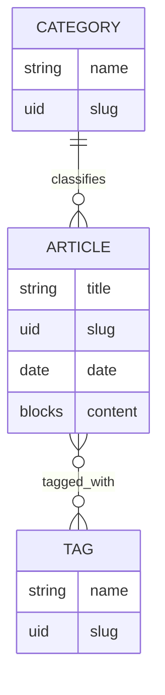

# Strapi 5 Training

Backend Headless CMS built with **Strapi 5** as a hands-on training project for learning content modeling, REST API, authentication, authorization, custom backend logic, middleware, policy, media handling, and other Strapi core concepts.

Project ini menggunakan studi kasus **Company Profile Website**, dengan struktur konten yang mencakup company profile, article/news, product, career, dan testimonial.

---

## 🛠 Tech Stack


| Technology          | Usage                      |
| ------------------- | -------------------------- |
| Strapi `5.53.0`     | Headless CMS / Backend     |
| TypeScript          | Backend development        |
| Node.js `20–26`     | Runtime                    |
| PostgreSQL          | Database                   |
| `pg 8.20.0`         | PostgreSQL driver          |
| Users & Permissions | Content API authentication |
| Nodemailer          | Email provider             |
| Mailpit             | Local SMTP testing         |
| Postman             | REST API testing           |


---

# 📁 Project Structure

```text
training-strapi/
├── config/
│   ├── admin.ts
│   ├── api.ts
│   ├── database.ts
│   ├── middlewares.ts
│   ├── plugins.ts
│   └── server.ts
│
├── database/
│   └── migrations/
│
├── postman/
│   ├── Training.postman_collection.json
│   └── Training.postman_environment.json
│
├── public/
│
├── src/
│   ├── admin/
│   │
│   ├── api/
│   │   ├── article/
│   │   ├── career/
│   │   ├── category/
│   │   ├── company-profile/
│   │   ├── product/
│   │   ├── tag/
│   │   └── testimonial/
│   │
│   ├── components/
│   │   └── company-profile/
│   │
│   ├── extensions/
│   │   └── users-permissions/
│   │
│   ├── middlewares/
│   │   └── request-logger.ts
│   │
│   └── index.ts
│
├── .env.example
├── docker-compose.yml
├── package.json
└── tsconfig.json
```

---


# 📦 Content Model

Project menggunakan kombinasi **Collection Type**, **Single Type**, **Component**, dan **Relation**.

## Collection Types


### Article

Digunakan untuk menyimpan berita atau artikel.

```text
Article
├── title
├── slug
├── date
├── image
├── content
├── category
└── tags
```

Beberapa constraint:

- `title` wajib dan unique
- `slug` menggunakan UID berdasarkan `title`
- `image` wajib dan dapat berisi multiple images
- `content` menggunakan Blocks
- `category` wajib
- `tags` wajib
- mendukung Draft & Publish


### Category

```text
Category
├── name
├── slug
└── articles
```

Satu category dapat digunakan oleh banyak article.

### Tag

```text
Tag
├── name
├── slug
└── articles
```

Article dan Tag menggunakan relasi **many-to-many**.

### Product

```text
Product
├── name
├── slug
├── image
└── description
```

Description menggunakan Blocks sehingga content dapat dikelola melalui Administration Panel.

### Career

```text
Career
├── position
├── slug
├── location
├── employment_type
├── description
├── requirements
├── responsibilities
├── is_active
└── expired_at
```

Employment type yang tersedia:

```text
FULL_TIME
PART_TIME
CONTRACT
INTERNSHIP
```


### Testimonial

```text
Testimonial
├── client_name
├── client_position
├── company_name
├── testimonial
├── client_photo
├── company_logo
└── rating
```

`rating` memiliki validasi nilai antara **1 sampai 5**.

---

# 🏢 Company Profile

Company Profile menggunakan **Single Type** karena hanya terdapat satu company profile dalam sistem.

```text
Company Profile
├── Company Overview
├── Vision & Mission
├── Business License
├── History
├── Management
└── Award
```

Bagian tersebut dipisahkan menjadi reusable Strapi Components.

### Available Components

```text
company-profile/
├── company-overview
├── vision-mission
├── business-license
├── history
├── history-item
├── management
└── award
```

Beberapa component seperti `Management` dan `Award` bersifat repeatable.

History menggunakan nested component:

```text
Company Profile
      │
      ▼
    History
      │
      ▼
History Item[]
```

---


# 🔗 Content Relationship

Relasi utama pada Article:




### Article → Category

Relasi:

```text
Many-to-One
```

Artinya:

```text
1 Article  → 1 Category
1 Category → Banyak Article
```


### Article ↔ Tag

Relasi:

```text
Many-to-Many
```

Artinya:

```text
1 Article → Banyak Tag
1 Tag     → Banyak Article
```

---


# 🔐 Authentication & Authorization

Project membedakan dua authentication/authorization context di Strapi.

## Administration Panel RBAC

Digunakan untuk user yang bekerja melalui:

```text
/admin
```

Contoh role:

### Admin

Memiliki akses penuh untuk:

- Content management
- Content-Type Builder
- User management
- Role & permission
- Plugin configuration
- Publish / unpublish content


### Editor

Digunakan untuk editorial workflow.

Contohnya:

- Create content
- Update content
- Publish jika permission diberikan
- Tidak mengubah konfigurasi Strapi

---


## Content API — Users & Permissions

Users & Permissions digunakan oleh consumer Content API.

Base endpoint:

```text
/api
```

Authentication ini **berbeda dengan Administration Panel RBAC**.

Dengan kata lain:

```text
Administration Panel User
          ≠
Users & Permissions User
```

Permission Public Content API harus dikonfigurasi secara terpisah melalui:

```text
Settings
└── Users & Permissions Plugin
    └── Roles
        └── Public
```

---


# 🔑 JWT & Session Configuration

Users & Permissions dikonfigurasi menggunakan refresh-token based JWT management.

```ts
'users-permissions': {
  config: {
    jwtManagement: 'refresh',
    sessions: {
      httpOnly: true,
    },
  },
},
```

Extension untuk content type User tersedia pada:

```text
src/extensions/users-permissions/
```

---


# 🌐 REST API

Base URL development:

```text
http://localhost:1337/api
```


## Core Endpoints


| Method | Endpoint                    | Description         |
| ------ | --------------------------- | ------------------- |
| GET    | `/api/articles`             | Get articles        |
| GET    | `/api/articles/:documentId` | Get article         |
| GET    | `/api/categories`           | Get categories      |
| GET    | `/api/tags`                 | Get tags            |
| GET    | `/api/products`             | Get products        |
| GET    | `/api/careers`              | Get careers         |
| GET    | `/api/testimonials`         | Get testimonials    |
| GET    | `/api/company-profile`      | Get company profile |


REST API Strapi juga mendukung:

```text
fields
filters
sort
populate
pagination
```

---


# 🔎 Query Optimization

Strapi memungkinkan frontend menentukan data yang benar-benar dibutuhkan.

Contoh:

```http
GET /api/articles
  ?fields[0]=title
  &fields[1]=slug
  &fields[2]=date
  &filters[date][$gte]=2024-01-01
  &filters[category][slug][$eq]=pertanian
  &filters[tags][slug][$in][0]=tani
  &populate[category][fields][0]=name
  &populate[tags][fields][0]=name
  &sort[0]=date:desc
  &sort[1]=title:asc
  &pagination[page]=1
  &pagination[pageSize]=10
```

Hal ini digunakan untuk menghindari pengiriman field atau relation yang tidak dibutuhkan frontend.

Pagination tersedia melalui:

```text
pagination[page]
pagination[pageSize]
```

atau offset pagination:

```text
pagination[start]
pagination[limit]
```

Kedua jenis pagination tersebut tidak digunakan secara bersamaan dalam satu request.

---


# ⚙️ Custom Backend

Project tidak hanya menggunakan Core API bawaan Strapi, tetapi juga mengimplementasikan custom backend logic.

## Latest Article

Endpoint:

```http
GET /api/articles/actions/latest
```

Optional query:

```http
GET /api/articles/actions/latest?limit=5
```

Flow:

```text
Request
   │
   ▼
Custom Route
   │
   ▼
Policy
   │
   ▼
Controller
   │
   ▼
Article Service
   │
   ▼
Document Service API
```

Endpoint hanya mengambil published article dengan field:

```text
title
slug
date
```

Article diurutkan berdasarkan:

```text
date DESC
title ASC
```

---


# 🛡 Custom Policy

File:

```text
src/api/article/policies/valid-latest-limit.ts
```

Policy digunakan pada endpoint:

```http
GET /api/articles/actions/latest
```

Tujuannya untuk memastikan parameter `limit`:

```text
integer
> 0
<= 10
```

Contoh valid:

```http
GET /api/articles/actions/latest?limit=5
```

Contoh invalid:

```http
GET /api/articles/actions/latest?limit=100
```

Dengan demikian request dapat dihentikan oleh policy sebelum masuk ke controller apabila parameter tidak valid.

---


# 📄 Article Summary Endpoint

Custom endpoint lainnya:

```http
GET /api/articles/actions/:documentId/summary
```

Endpoint mengambil ringkasan article beserta:

```text
title
slug
date
category
tags
```

Hanya article dengan status:

```text
published
```

yang akan dikembalikan.

Jika article tidak ditemukan, API memberikan response `404`.

---


# 🧠 Controller & Service Separation

Custom Article API menerapkan separation of concern:

```text
Controller
│
├── membaca request
├── validasi input HTTP
├── memanggil service
└── membuat HTTP response

Service
│
├── business/data access logic
├── Document Service query
├── sorting
├── field selection
└── relation population
```

Dengan pendekatan ini, query yang reusable tidak ditempatkan langsung seluruhnya di controller.

---


# 🚫 Category Delete Protection

Project menggunakan **Document Service Middleware** pada:

```text
src/index.ts
```

Middleware tersebut mencegah Category dihapus apabila masih digunakan oleh Article.

Flow:

```text
DELETE Category
      │
      ▼
Document Service Middleware
      │
      ▼
Cari Article dengan Category tersebut
      │
      ├── Article ditemukan
      │       │
      │       ▼
      │   ApplicationError
      │
      └── Tidak digunakan
              │
              ▼
           next()
              │
              ▼
          Delete Category
```

Error:

```text
Category cannot be deleted because it is still used by an article.
```

Proteksi ini menjaga **referential/business integrity** pada level aplikasi.

---


# 📝 Global Request Logger

Custom middleware:

```text
src/middlewares/request-logger.ts
```

Middleware dijalankan secara global dan mencatat request yang mengarah ke `/api`.

Informasi yang dicatat:

```text
HTTP Method
Request Path
HTTP Status
Request Duration
User ID / Public
IP Address
```

Contoh log:

```text
[API] | GET | /api/articles | status=200 | duration=15ms | user=public | ip=127.0.0.1
```

Middleware diregistrasikan melalui:

```text
config/middlewares.ts
```

---


# 📁 Media Upload Security

Upload plugin memiliki konfigurasi whitelist dan blacklist MIME type.

Beberapa jenis file yang diperbolehkan:

```text
image/*
video/*
audio/*
application/pdf
application/msword
Office Open XML documents
text/plain
text/csv
```

Beberapa jenis file yang ditolak:

```text
SVG
Windows executable
Shell script
Mach binary
```

Contoh denied MIME type:

```text
image/svg+xml
application/x-msdownload
application/x-executable
application/x-sh
text/x-shellscript
application/x-mach-binary
```

Konfigurasi terdapat pada:

```text
config/plugins.ts
```

---


# 📧 Email & Local SMTP

Project menggunakan:

```text
@strapi/provider-email-nodemailer
```

Untuk development, tersedia Mailpit melalui Docker Compose.

Jalankan:

```bash
docker compose up -d
```

Mailpit SMTP:

```text
Host : 127.0.0.1
Port : 1025
```

Mailpit Web UI:

```text
http://localhost:8025
```

Dengan Mailpit, email development dapat diuji tanpa mengirim email sungguhan ke external email provider.

---


# 🔧 Environment Variables

Buat `.env` berdasarkan:

```text
.env.example
```

Variables utama:


| Variable              | Description                     |
| --------------------- | ------------------------------- |
| `HOST`                | Strapi bind address             |
| `PORT`                | Strapi port                     |
| `APP_KEYS`            | Application signing keys        |
| `API_TOKEN_SALT`      | API token salt                  |
| `ADMIN_JWT_SECRET`    | Administration Panel JWT secret |
| `TRANSFER_TOKEN_SALT` | Transfer token salt             |
| `JWT_SECRET`          | Users & Permissions JWT secret  |
| `ENCRYPTION_KEY`      | Internal encryption key         |
| `DATABASE_CLIENT`     | Database driver                 |
| `DATABASE_HOST`       | Database host                   |
| `DATABASE_PORT`       | Database port                   |
| `DATABASE_NAME`       | Database name                   |
| `DATABASE_USERNAME`   | Database username               |
| `DATABASE_PASSWORD`   | Database password               |
| `DATABASE_SCHEMA`     | PostgreSQL schema               |
| `DATABASE_SSL`        | Enable database SSL             |
| `SMTP_HOST`           | SMTP server                     |
| `SMTP_PORT`           | SMTP port                       |
| `SMTP_USERNAME`       | SMTP username                   |
| `SMTP_PASSWORD`       | SMTP password                   |


---

# 🚀 Getting Started

## 1. Clone Repository

```bash
git clone https://github.com/PutuRivan/training-strapi.git
cd training-strapi
```


## 2. Install Dependencies

```bash
npm ci
```


## 3. Configure Environment

Copy:

```text
.env.example
```

menjadi:

```text
.env
```

Kemudian sesuaikan konfigurasi PostgreSQL dan secret.

---


## 4. Create PostgreSQL Database

Contoh berdasarkan default `.env.example`:

```text
DATABASE_NAME=training
DATABASE_USERNAME=strapi
DATABASE_PASSWORD=change-me
```

Pastikan database dan PostgreSQL user sudah tersedia sebelum Strapi dijalankan.

---


## 5. Start Mailpit

Optional, tetapi diperlukan jika ingin menguji email secara lokal.

```bash
docker compose up -d
```

Buka:

```text
http://localhost:8025
```

---


## 6. Start Strapi

Development mode:

```bash
npm run develop
```

atau:

```bash
npm run dev
```

Administration Panel:

```text
http://localhost:1337/admin
```

Content API:

```text
http://localhost:1337/api
```

---


# 🏭 Production Build

Build:

```bash
npm run build
```

Run production server:

```bash
npm start
```

---


# 🧪 Postman

Postman collection tersedia di:

```text
postman/
├── Training.postman_collection.json
└── Training.postman_environment.json
```

Import kedua file tersebut ke Postman.

Kemudian pilih environment:

```text
Training
```

Collection digunakan untuk menguji:

- Health & setup
- Public Content API
- Filtering
- Sorting
- Fields
- Populate
- Pagination
- Authentication
- Authorization
- CRUD
- Custom Route
- Custom Controller
- Custom Service
- Policy
- Middleware
- Error handling
- Final CRUD flow

Beberapa test script juga melakukan pemeriksaan terhadap:

```text
HTTP Status
Response Time
JWT
Document ID
```

Request login dapat menyimpan JWT ke environment, sedangkan final CRUD flow dapat menyimpan `documentId` hasil create untuk digunakan pada request berikutnya.

---


# 🧪 Example API Testing Flow

Flow sederhana untuk Article:

```text
GET Articles
     │
     ▼
GET Article Detail
     │
     ▼
Filter Article
     │
     ▼
Populate Category / Tags
     │
     ▼
GET Latest Article
     │
     ▼
GET Article Summary
```

Untuk CRUD:

```text
Authentication
      │
      ▼
Create Content
      │
      ▼
Read Content
      │
      ▼
Update Content
      │
      ▼
Delete Content
```

---


# 🧩 Strapi Concepts Implemented


| Concept                     | Status |
| --------------------------- | ------ |
| Collection Type             | ✅      |
| Single Type                 | ✅      |
| Component                   | ✅      |
| Nested Component            | ✅      |
| Relation                    | ✅      |
| Draft & Publish             | ✅      |
| Media Library               | ✅      |
| Blocks                      | ✅      |
| REST API                    | ✅      |
| Filtering                   | ✅      |
| Sorting                     | ✅      |
| Fields Selection            | ✅      |
| Populate                    | ✅      |
| Pagination                  | ✅      |
| Administration Panel RBAC   | ✅      |
| Users & Permissions         | ✅      |
| JWT Authentication          | ✅      |
| Custom Route                | ✅      |
| Custom Controller           | ✅      |
| Custom Service              | ✅      |
| Policy                      | ✅      |
| Global Middleware           | ✅      |
| Document Service Middleware | ✅      |
| Upload Security             | ✅      |
| Email Provider              | ✅      |
| Local SMTP Testing          | ✅      |
| Postman API Collection      | ✅      |


---


# 📚 Key Learning Points

Beberapa konsep penting yang ditunjukkan project ini:

### Strapi bukan hanya CRUD Generator

Core API memang dapat dibuat otomatis dari Content-Type Builder, tetapi behavior backend tetap dapat diperluas menggunakan:

```text
Route
Controller
Service
Policy
Middleware
Document Service
Plugin Extension
```


### Administration RBAC berbeda dengan Content API Permission

Role pada Administration Panel mengatur **siapa yang dapat mengelola CMS**.

Users & Permissions mengatur **siapa yang dapat mengakses Content API**.

Keduanya merupakan sistem authorization yang berbeda.

### Relation membutuhkan business rule

Database relation saja belum tentu cukup untuk kebutuhan aplikasi.

Contohnya pada project ini, Category tidak boleh dihapus apabila masih digunakan Article. Rule tersebut diterapkan melalui Document Service Middleware.

### Frontend tidak harus menerima seluruh data

REST query Strapi seperti:

```text
fields
populate
filters
sort
pagination
```

memungkinkan frontend meminta payload sesuai kebutuhan.

---


# ✅ Final Training Verification

Sebelum training dianggap selesai, lakukan verification berikut:

1. Administration Panel dapat dijalankan.
2. PostgreSQL berhasil terhubung.
3. Seluruh Content Type tersedia.
4. Company Profile Components tersedia.
5. Article → Category relation bekerja.
6. Article ↔ Tag relation bekerja.
7. Draft & Publish bekerja.
8. Public Content API permission dapat diuji.
9. Administration Panel Admin dan Editor mempunyai permission berbeda.
10. Filtering, sorting, fields, populate, dan pagination berhasil diuji.
11. Custom latest Article endpoint berhasil.
12. Policy menolak `limit` yang tidak valid.
13. Article summary endpoint berhasil.
14. Category yang masih digunakan Article tidak dapat dihapus.
15. Global request logger mencatat Content API request.
16. Upload security menolak MIME type yang dilarang.
17. Nodemailer dapat menggunakan local Mailpit.
18. Postman collection dapat digunakan untuk API verification.
19. `npm run build` berhasil tanpa error.

---


# 📖 References

- [Strapi Documentation](https://docs.strapi.io/)
- [Strapi GitHub](https://github.com/strapi/strapi)
- [Strapi REST API Documentation](https://docs.strapi.io/cms/api/rest)
- [Strapi Users & Permissions](https://docs.strapi.io/cms/features/users-permissions)
- [Strapi Document Service API](https://docs.strapi.io/cms/api/document-service)

---


## 👨‍💻 Author

**Putu Rivan**

GitHub: [@PutuRivan](https://github.com/PutuRivan)

---

> This repository is intended as a hands-on Strapi training and learning project using a realistic Company Profile CMS use case.

